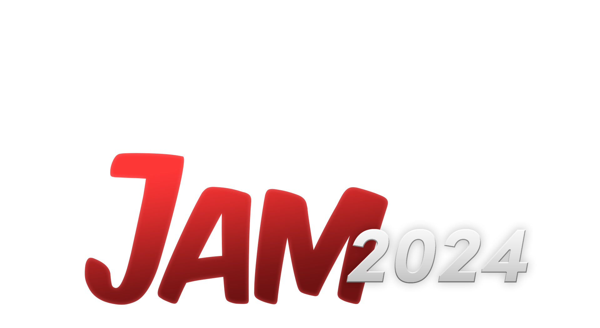

Links:

- Repository: [https://github.com/zaftnotameni/gmtk-2024](https://github.com/zaftnotameni/gmtk-2024)
- Our Game on Itch: [https://hotnoggin.itch.io/gmtk-2024](https://hotnoggin.itch.io/gmtk-2024)
- Jam: [https://itch.io/jam/gmtk-2024](https://itch.io/jam/gmtk-2024)
- Theme: [https://www.youtube.com/watch?v=iIbTPpfvZBQ](https://www.youtube.com/watch?v=iIbTPpfvZBQ)

Categories:

- ⭐⭐⭐⭐⭐ **Enjoyment**
- ⭐⭐⭐⭐⭐ **Creativity**
- ⭐⭐⭐⭐⭐ **Presentation**

Team:

- [HotNoggin](https://github.com/HotNoggin)
- [TheNetherPug](https://github.com/TheNetherPug)
- [ZAFT](https://github.com/zaftnotameni)

## Godot Editor for the Project

You must have `Godot_v4.3-rc3_win64_console.exe` in your `PATH`.

```ps
bat\editor-rc.bat
```

## Deploying the project

You must have `Godot_v4.3-rc3_win64_console.exe` and `butler.exe` in your `PATH`.

```ps
bat\export-and-itch-all.bat
```

This will export the project for web, windows and linux and deploy it to itch.

The command above is made of a few smaller commands. There are also individual commands for each part:

- `bat\export-web.bat`: export for web
- `bat\export-win.bat`: export for linux
- `bat\export-lin.bat`: export for windows
- `bat\itch-web.bat`: deploy for web on itch using butler (requires export first)
- `bat\itch-win.bat`: deploy for linux on itch using butler (requires export first)
- `bat\itch-lin.bat`: deploy for windows on itch using butler (requires export first)

## Automatic builds on Github

Pushing a tag in the format `v0.0.1` (the `v` is important) triggers an automatic build on github for all platforms.

This might not be fully functional though because it can be missing secrets (like leaderboard api keys).
